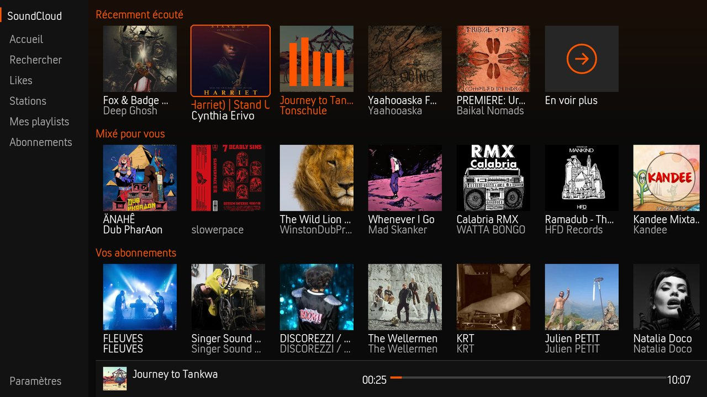
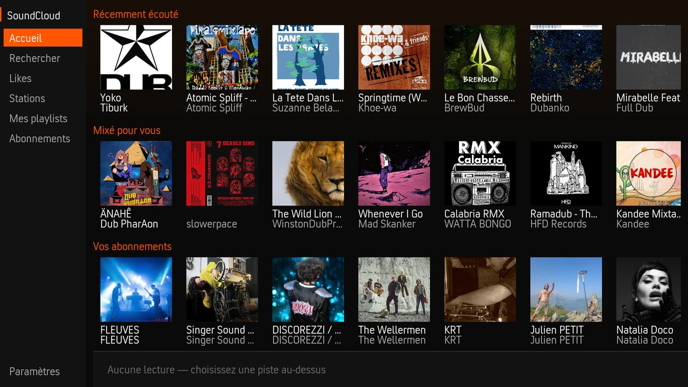
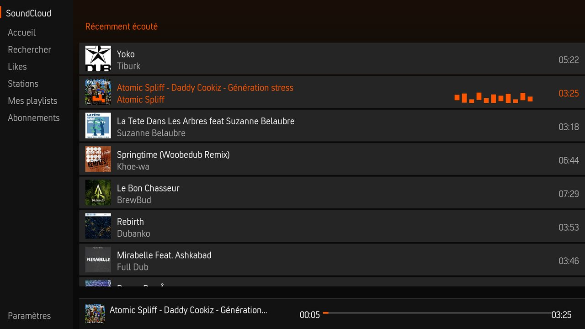
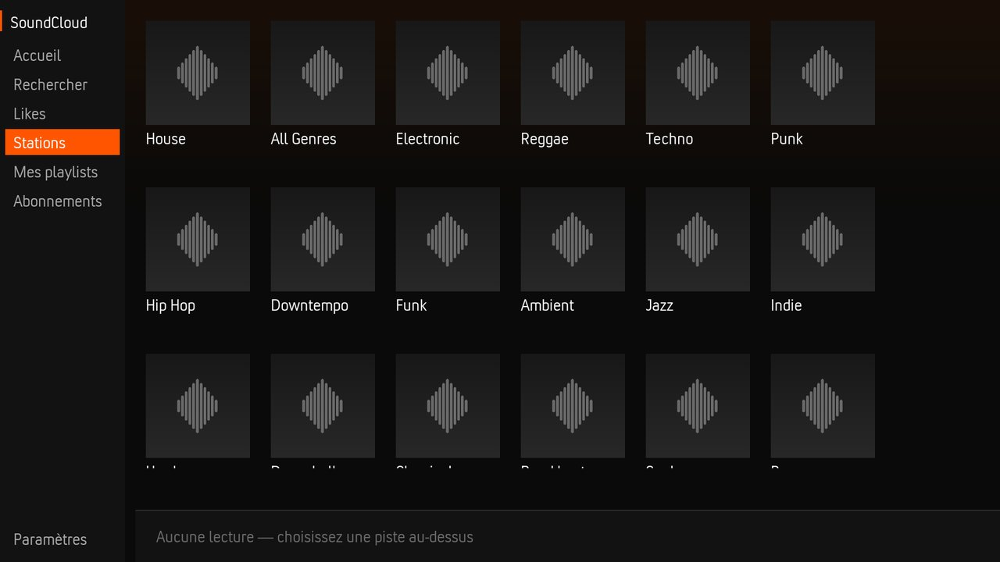
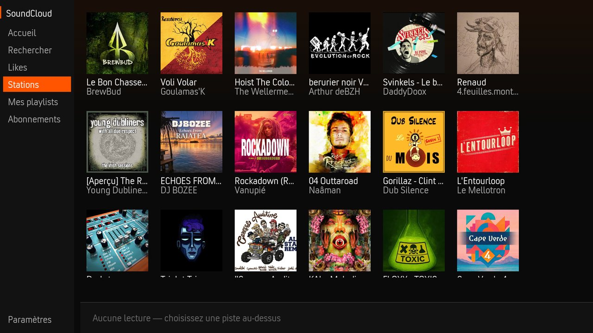
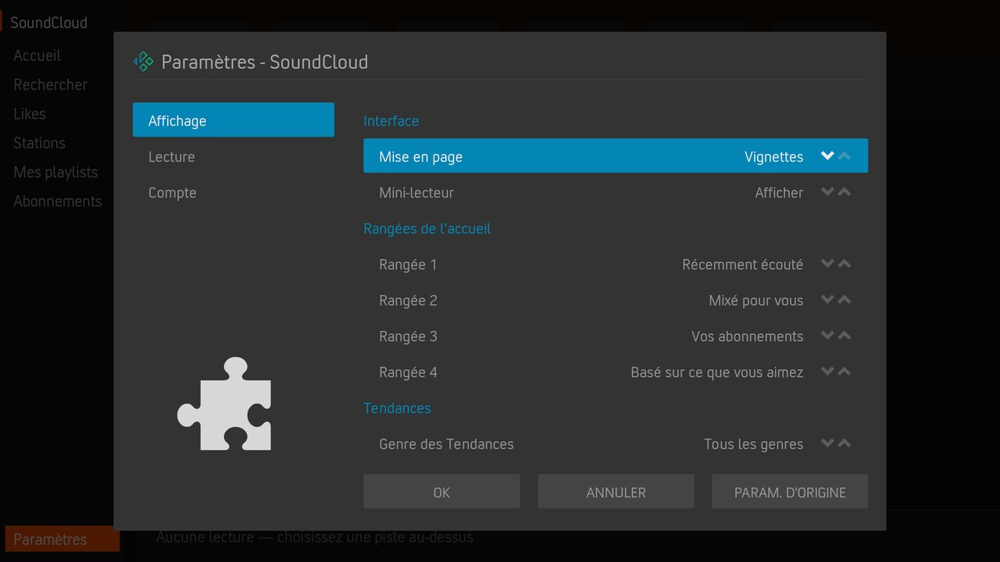
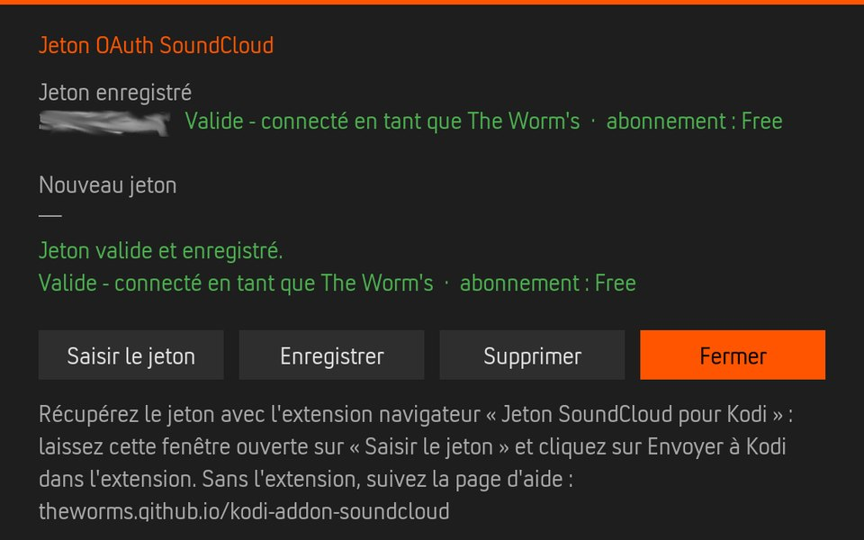
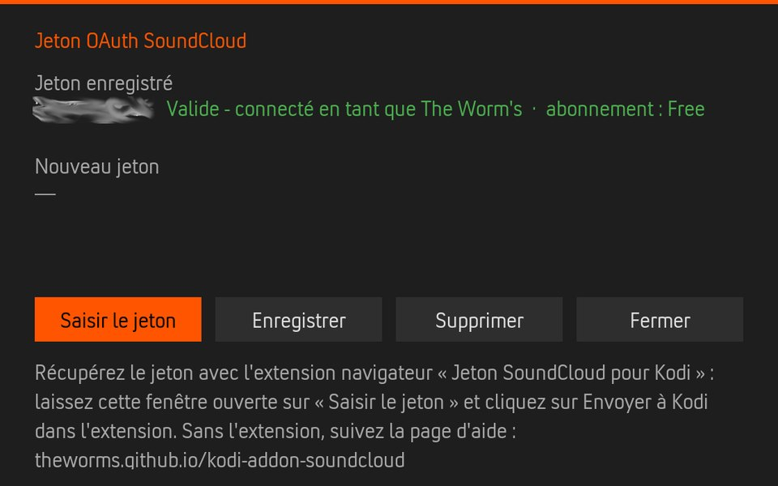

**Français** &nbsp;|&nbsp; [English](readme.en.md)

# Add-on SoundCloud pour [Kodi](https://github.com/xbmc/xbmc)

<!-- version:auto -->
**Version : 6.0.2**
<!-- /version:auto -->

SoundCloud dans Kodi, avec une vraie interface plein écran : menu
latéral, rangées d'accueil personnalisables, file de lecture
automatique, mini-lecteur, stations et quatre écrans « En lecture ».
Connectez votre compte en un clic grâce à l'extension navigateur
fournie, et retrouvez vos j'aime, playlists, abonnements et votre
historique d'écoute.

> **Fork communautaire** de
> [jaylinski/kodi-addon-soundcloud](https://github.com/jaylinski/kodi-addon-soundcloud),
> maintenu sur [TheWorms/kodi-addon-soundcloud](https://github.com/TheWorms/kodi-addon-soundcloud).
> Les rapports de bug et demandes concernant l'interface plein écran
> (v5 et suivantes) se font ici ; pour l'ancien menu plugin (v4 et
> antérieures), voyez le projet d'origine.

## Sommaire

- [Fonctionnalités](#fonctionnalités)
- [Captures d'écran](#captures-décran)
- [Installation](#installation)
- [Connexion au compte SoundCloud](#connexion-au-compte-soundcloud)
- [Utilisation](#utilisation)
- [Paramètres](#paramètres)
- [Écrans « En lecture »](#écrans--en-lecture-)
- [Ouvrir SoundCloud plus vite](#ouvrir-soundcloud-plus-vite)
- [Widgets pour l'écran d'accueil](#widgets-pour-lécran-daccueil)
- [Confidentialité](#confidentialité)
- [Dépannage](#dépannage)
- [Nouveautés](#nouveautés)
- [Crédits et licence](#crédits-et-licence)

## Fonctionnalités

**Interface**
- Menu latéral : Accueil, Rechercher, Likes, Stations, Mes playlists,
  Abonnements et Paramètres.
- Deux mises en page, modifiables à chaud : **Vignettes** (rangées
  horizontales) ou **Liste** (grandes listes verticales).
- Accueil en **4 rangées configurables**, chacune ouverte en page
  complète par la carte **« En voir plus »**.
- **Mini-lecteur** en bas de l'écran (pochette, titre, progression),
  masquable.
- Le morceau en cours est signalé partout : **vague orange** sur la
  pochette, titre et durée en orange en mode Liste. Les rangées
  suivent la file de lecture.

**Lecture**
- Un clic sur un morceau met en file tous les morceaux de la rangée ou
  de la page.
- Lecture aléatoire, **lecture sans fin** (morceaux similaires ajoutés
  quand la file se termine), **minuterie d'arrêt**.
- Format audio au choix : Opus léger, MP3 HLS adaptatif ou MP3
  progressif.
- Reprise automatique quand une adresse de flux SoundCloud expire en
  plein morceau.

**Compte SoundCloud** (avec jeton OAuth)
- Vos likes, playlists, abonnements et votre historique d'écoute.
- Rangées personnalisées : « Récemment écouté », « Mixé pour vous »,
  « Basé sur ce que vous aimez ».
- Ajout et retrait de likes depuis Kodi (menu contextuel).
- Vos stations likées, en plus des stations de genre.

**Et aussi**
- Quatre écrans plein écran « En lecture » : Cinéma, Forme d'onde,
  Éditorial et Vinyle.
- Widgets pour l'écran d'accueil de Kodi.
- Service d'arrière-plan optionnel pour une ouverture instantanée.
- Interface en français et en anglais (allemand et néerlandais
  partiels).

## Captures d'écran

| Accueil, mode Vignettes | Mise en page Liste |
|:---:|:---:|
|  |  |
| **Stations** | **Contenu d'une station** |
|  |  |
| **Paramètres** | **Fenêtre « Jeton OAuth »** |
|  |  |

## Installation

**Recommandé : le dépôt TheWorms**, pour recevoir les mises à jour
automatiquement.

1. Téléchargez le dépôt :
   **[repository.theworms.zip](https://raw.githubusercontent.com/TheWorms/kodi-repo/main/zips/repository.theworms/repository.theworms.zip)**.
2. Dans Kodi : **Extensions → Installer depuis un fichier zip** →
   choisissez le zip. Si Kodi refuse, activez **Sources inconnues**
   dans *Système → Extensions*.
3. **Installer depuis un dépôt → TheWorms Repository → Extensions
   musique → SoundCloud**.

**Installation manuelle** : téléchargez le zip de l'addon depuis la
page [Releases](../../releases), puis **Installer depuis un fichier
zip**. Les mises à jour ne seront alors pas automatiques.

**Prérequis** : Kodi 21 « Omega ». Les dépendances
(`script.module.requests`) sont installées automatiquement.

### Pillow (optionnel)

Avec [Pillow](https://pypi.org/project/Pillow/)
(`script.module.pil`), les écrans « En lecture » affichent la pochette
floutée en arrière-plan. Sans Pillow, elle est simplement assombrie.
Installez-le depuis le dépôt officiel de Kodi (*Extensions →
Rechercher → Pillow*) ; l'addon le détecte au morceau suivant.

## Connexion au compte SoundCloud

L'addon fonctionne sans compte (recherche, tendances, stations de
genre). Pour vos likes, playlists, abonnements et votre historique, il
lui faut le **jeton OAuth** de votre session soundcloud.com.
SoundCloud n'accepte plus de nouvelles applications sur son API
publique depuis 2021, il n'y a donc pas de bouton « Se connecter » :
l'addon réutilise le jeton du site.

Le plus simple est l'**extension navigateur** fournie, qui récupère le
jeton et l'envoie à Kodi. Toute la procédure, illustrée, est sur la
page d'aide :

**➜ [theworms.github.io/kodi-addon-soundcloud](https://theworms.github.io/kodi-addon-soundcloud/get-token.html)**

1. **Installez l'extension « Jeton SoundCloud pour Kodi »**
   ([télécharger](https://theworms.github.io/kodi-addon-soundcloud/soundcloud-token-extension.zip)
   ; Firefox 128+, Chrome, Edge, Brave). Sous Firefox elle se charge
   comme module temporaire, à recharger après un redémarrage du
   navigateur ; la page d'aide détaille l'installation. Code source :
   [`tools/token-extension`](tools/token-extension).
2. **Ouvrez [soundcloud.com](https://soundcloud.com)** en étant
   connecté. L'icône de l'extension affiche un badge vert **OK** quand
   le jeton est récupéré et accepté par SoundCloud.
3. **Dans Kodi**, ouvrez *Paramètres → Compte → Gérer le jeton
   OAuth…* : la fenêtre indique si le jeton enregistré est encore
   valide.
4. **Dans l'extension, cliquez sur « Envoyer à Kodi »** (adresse IP de
   Kodi, utilisateur et mot de passe du serveur web). L'extension ouvre
   le clavier de la fenêtre et tape le jeton. Kodi doit autoriser
   *Paramètres → Services → Contrôle → Autoriser le contrôle à
   distance via HTTP*.
5. **Appuyez sur Enregistrer.** SoundCloud est interrogé tout de suite :
   **valide** (avec votre nom et votre abonnement), **refusé** (jeton
   expiré ou erroné, il n'est pas gardé) ou **vérification
   impossible** (vous choisissez de l'enregistrer quand même).

 

**Sans envoi automatique** : *Copier le jeton* dans l'extension, puis
*Saisir le jeton* dans Kodi et collez-le (une télécommande comme Kore
ou Yatse permet de coller depuis le téléphone).

**Sans l'extension** : la page d'aide décrit aussi la méthode par
l'onglet Réseau des outils de développement (F12), le cookie
`oauth_token`, et le script
[`scripts/get_soundcloud_token.py`](scripts/get_soundcloud_token.py),
qui lit le jeton dans votre profil Firefox et peut l'envoyer à Kodi.

**Renouvellement** : un jeton expire au bout de quelques mois, ou quand
vous vous déconnectez de soundcloud.com. La ligne *Paramètres → Compte
→ État du jeton* résume la dernière vérification. Un nouveau jeton est
pris en compte immédiatement, sans redémarrer Kodi : l'interface
recharge elle-même ses rangées.

**Free, Go, Go+** : les trois abonnements fonctionnent. Sur un compte
Free, SoundCloud ne fournit qu'un extrait de 30 secondes des morceaux
réservés à Go+ ; l'option *Ignorer les extraits Go+* les retire de la
file.

## Utilisation

- **Navigation** : Droite depuis le menu latéral entre dans le contenu,
  Retour revient à la page précédente puis ferme l'addon.
- **Lecture** : OK sur un morceau lance la lecture et met en file le
  reste de la rangée ou de la page. Sur une playlist, un artiste ou une
  station, OK ouvre son contenu.
- **« En voir plus »** : la dernière carte d'une rangée pleine ouvre
  la rangée en page complète, avec *Page suivante* quand SoundCloud en
  propose davantage.
- **Likes** : menu contextuel (touche C ou appui long) sur un morceau →
  *Ajouter à vos likes* / *Retirer de vos likes*.
- **Mini-lecteur** : pochette, titre et progression du morceau en
  cours ; les touches lecture/pause, suivant et précédent de la
  télécommande pilotent la file.
- **Paramètres** : le bouton en bas du menu latéral. Les changements
  d'affichage (mise en page, rangées, genre des tendances) s'appliquent
  au retour dans l'interface, sans la rouvrir.

## Paramètres

| Onglet | Réglage | Rôle |
|---|---|---|
| **Affichage** | Mise en page | *Vignettes* ou *Liste* |
| | Mini-lecteur | Afficher ou masquer la barre du bas |
| | Rangée 1 à 4 | Contenu de chaque rangée d'accueil : Vos likes, Tendances, Vos playlists, Vos abonnements, Récemment écouté, Mixé pour vous, Basé sur ce que vous aimez, Créé par SoundCloud, Buzzing artistes, ou désactivée |
| | Genre des Tendances | Tous les genres, Techno, House, Deep House, Électronique, Hip-hop, Ambient, Jazz… |
| **Lecture** | Format audio | Opus léger, MP3 HLS adaptatif, MP3 progressif (par défaut, le plus stable) |
| | Lecture automatique, Lecture aléatoire | Enchaîner la file, dans l'ordre ou non |
| | Ignorer les extraits Go+ | Retirer de la file les extraits de 30 s |
| | Lecture sans fin | Ajouter des morceaux similaires à la fin de la file |
| | Minuterie d'arrêt | Arrêt après 15, 30, 60 ou 120 min d'écoute effective (la pause suspend le décompte) |
| | Pistes par page | 10, 20, 30 ou 50 éléments par rangée et par page |
| | Plein écran automatique, style, délai | Voir [Écrans « En lecture »](#écrans--en-lecture-) |
| **Compte** | Gérer le jeton OAuth… | Ouvre la fenêtre du jeton |
| | État du jeton | Résultat de la dernière vérification (lecture seule) |
| | Vider le cache | Efface les réponses SoundCloud gardées en cache par l'addon |
| | Service en arrière-plan | Ouverture instantanée de l'addon (redémarrage de Kodi requis) |

## Écrans « En lecture »

Pendant la lecture, l'addon peut afficher un écran plein écran
par-dessus l'interface. Choisissez le style dans *Paramètres → Lecture
→ Style écran de lecture* ; *Plein écran automatique* et *Délai avant
ouverture* décident s'il s'ouvre tout seul et au bout de combien de
temps.

| Style | Apparence |
|---|---|
| **Désactivé** | Pas d'écran plein écran, seulement le mini-lecteur |
| **Cinéma** | Pochette centrée avec un lent zoom, fond flouté, titre et artiste en dessous |
| **Forme d'onde** | Barres orange animées en bas de l'écran, barre de progression réelle au-dessus |
| **Éditorial** | Mise en page magazine : pochette à gauche, titre en grand et citation tirée de la description du morceau |
| **Vinyle avec pochette** | Disque vinyle qui tourne, pochette au centre |

**Touches**

| Touche | Action |
|---|---|
| OK | Pause / reprise |
| Gauche / Droite | Recul / avance de 10 s (*Intervalle de déplacement* : 5 à 30 s) |
| Haut | Morceau suivant |
| Bas | Retour au début du morceau, ou morceau précédent dans les 3 premières secondes |
| Retour | Fermer l'écran (la lecture continue) |

L'API Python de Kodi ne donne pas accès au signal audio : l'animation
*Forme d'onde* est décorative, seule la barre de progression suit la
lecture. La rotation du vinyle peut saccader sur les appareils
anciens (Raspberry Pi 3…). La citation *Éditorial* reste vide quand le
morceau n'a pas de description.

## Ouvrir SoundCloud plus vite

Ouvert depuis *Musique → Extensions*, Kodi affiche un instant son
navigateur musical avant l'interface. Trois façons de l'éviter :

1. **Service en arrière-plan** (recommandé) : *Paramètres → Compte →
   Service en arrière-plan*, puis redémarrez Kodi. L'écran de
   chargement apparaît en ~50 ms. Coût : quelques Mo de mémoire.
2. **Favori Kodi** : ajoutez SoundCloud aux favoris, puis dans
   `userdata/favourites.xml` remplacez l'action par
   `RunScript(plugin.audio.soundcloud)`.
3. **Raccourci du menu d'accueil** de votre skin, avec l'action
   `RunScript(plugin.audio.soundcloud)` (Arctic Zephyr Reloaded :
   *Configurer le skin → Personnaliser le menu d'accueil* ; Estuary :
   *Personnaliser le menu d'accueil → Action*).

## Widgets pour l'écran d'accueil

L'addon fournit des listes simples que les widgets de skin peuvent
afficher :

| Adresse | Contenu |
|---|---|
| `plugin://plugin.audio.soundcloud/widget/likes/` | Vos likes (jeton requis) |
| `plugin://plugin.audio.soundcloud/widget/playlists/` | Vos playlists (jeton requis) |
| `plugin://plugin.audio.soundcloud/widget/following/` | Vos abonnements (jeton requis) |
| `plugin://plugin.audio.soundcloud/widget/trending/` | Tendances |
| `plugin://plugin.audio.soundcloud/widget/discover/` | Découvertes |
| `plugin://plugin.audio.soundcloud/widgets/` | Liste de tous les widgets ci-dessus |

- **Estuary** et les skins qui permettent de parcourir un addon :
  *Ajouter un widget → Extensions → Extensions musique → SoundCloud*,
  puis choisissez directement le widget voulu.
- **Arctic Zephyr Reloaded** et les skins qui ne prennent que l'adresse
  racine : le widget affiche la liste des widgets (*Likes*, *Mes
  playlists*, *Tendances*…) précédée de *▶ Ouvrir SoundCloud*. Pour un
  widget de contenu direct, il faut un skin qui accepte une adresse
  personnalisée (par exemple via Skin Helper Service).

Un morceau choisi dans un widget ouvre l'interface et le joue. Avec
*Enchaîner sur la catégorie du widget*, la suite de la catégorie est
mise en file.

## Confidentialité

- Le jeton est enregistré **uniquement** dans les paramètres de l'addon,
  sur votre appareil, et envoyé **uniquement** à
  `api-v2.soundcloud.com`.
- Il est masqué dans `kodi.log` (`OAuth <redacted>`).
- L'extension garde le jeton en mémoire seulement (oublié à la
  fermeture du navigateur) et ne contacte Kodi que quand vous cliquez
  sur *Envoyer à Kodi*. Le contrôle à distance de Kodi étant en HTTP,
  le jeton traverse alors votre réseau local en clair, comme avec
  toute télécommande Kodi.

## Dépannage

| Symptôme | Cause et solution |
|---|---|
| Les rangées personnelles affichent les Tendances | Pas de jeton, ou jeton expiré : ouvrez *Gérer le jeton OAuth…*, la fenêtre indique lequel des deux |
| L'extension indique « Kodi injoignable » | Vérifiez l'adresse IP de Kodi et l'option *Autoriser le contrôle à distance via HTTP* |
| Un morceau s'arrête au bout de 30 s | Extrait Go+ sur un compte Free ; activez *Ignorer les extraits Go+* |
| Le navigateur musical apparaît à l'ouverture | Voir [Ouvrir SoundCloud plus vite](#ouvrir-soundcloud-plus-vite) |
| Listes qui ne se mettent pas à jour | *Paramètres → Compte → Vider le cache* |

## Nouveautés

**6.0.2**
- Mode Vignettes : carte **« En voir plus »** en bout de rangée, comme
  en mode Liste.
- Vague de lecture sur **toute la hauteur** de la pochette.
- Les rangées **suivent la file** : la vignette du morceau suivant
  vient à l'écran.
- Correctif : avec les paramètres ouverts, toute une rangée affichait
  la vague de lecture.

**6.0.1**
- Fenêtre **« Jeton OAuth »** avec bouton *Enregistrer* et vérification
  immédiate ; l'entrée du jeton quitte le menu latéral pour les
  paramètres.
- **Extension navigateur** « Jeton SoundCloud pour Kodi » et page
  d'aide réécrite autour d'elle.
- « Mixé pour vous » ne recopie plus « Récemment écouté » (historique
  lu au bon endpoint).

**6.0**
- Stations, cinq nouvelles rangées d'accueil, lecture sans fin,
  minuterie d'arrêt, likes depuis l'addon, mise en page Liste,
  mini-lecteur simplifié, écran « En lecture » automatique.
- Correctifs de stabilité et de sécurité issus d'un audit (threads
  arrêtés proprement, jeton jamais envoyé hors de SoundCloud, erreurs
  d'API sans plantage).

**v5** a introduit l'interface plein écran, qui remplace l'ancien menu
plugin depuis la 5.7. L'historique détaillé de chaque version est dans
la balise `<news>` de [`addon.xml`](addon.xml).

## Crédits et licence

Fork maintenu par **[TheWorms](https://github.com/TheWorms)** :
interface plein écran, connexion par jeton OAuth et extension
navigateur, widgets, écrans « En lecture », traduction française,
service d'arrière-plan.

Basé sur [l'add-on SoundCloud de jaylinski](https://github.com/jaylinski/kodi-addon-soundcloud),
lui-même inspiré de [l'add-on d'origine](https://github.com/SLiX69/plugin.audio.soundcloud)
de [bromix](https://kodi.tv/addon-author/bromix) et
[SLiX](https://github.com/SLiX69).

Sous licence MIT, comme les projets d'origine : voir
[`LICENSE.txt`](LICENSE.txt). Cet addon n'est ni officiel, ni approuvé
par SoundCloud.
